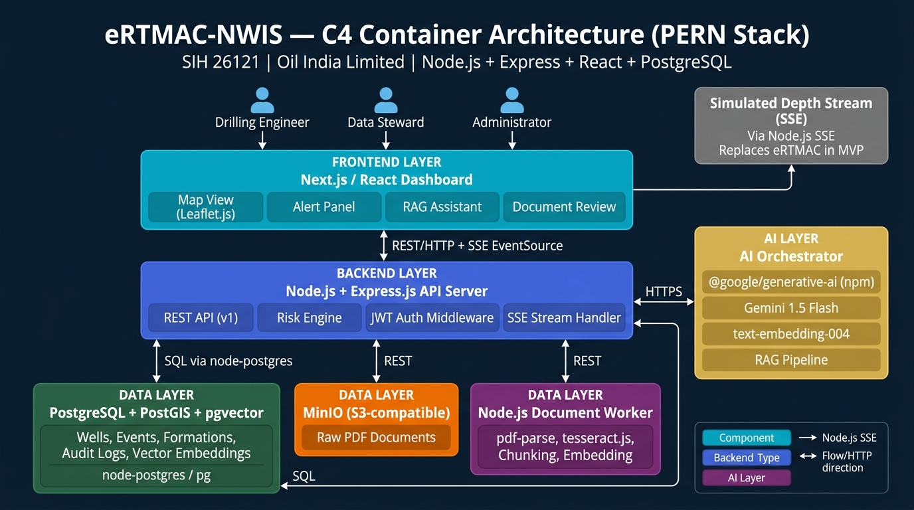

# Architecture Diagram & Description
## eRTMAC-NWIS (Nearby Wells Intelligence System)
**SIH 26121 | Oil India Limited | Document Version: 2.1 — PERN Stack**

---

## C4 Container Architecture Diagram



---

## Component Descriptions

### Users (External)

| Actor | Interaction Point |
|---|---|
| Drilling Engineer | Next.js dashboard — views map, risk panel, AI assistant |
| Data Steward | Next.js dashboard — uploads documents, reviews extracted events |
| Administrator | Next.js dashboard — manages users, config, thresholds, audit |

---

### Frontend Layer — Next.js / React

| Sub-component | Technology | Purpose |
|---|---|---|
| Map View | Leaflet.js + OpenStreetMap | Well markers, radius filter, event overlays |
| Alert Panel | React + SSE EventSource | Real-time risk alerts via SSE stream |
| RAG Assistant | React chat component | Natural-language Q&A with source cards |
| Document Review | React table + form | Extracted event review and approval workflow |

**Communication:** REST/HTTP to FastAPI (`/api/v1/*`); SSE EventSource to `/api/v1/stream/live/{well_id}`

---

### Backend Layer — Node.js + Express.js API Server

| Sub-component | Technology | Purpose |
|---|---|---|
| REST API | Express.js + Zod | 25+ typed and validated endpoints across all domains |
| Risk Engine | Pure JavaScript (math) | Weighted formula: depth + formation + recurrence + context |
| Auth Middleware | `jsonwebtoken` + `bcrypt` npm | JWT access/refresh tokens, RBAC enforcement |
| SSE Stream Handler | Node.js `res.write()` + `EventEmitter` | Depth simulation + risk alert push to frontend `EventSource` |

**Communication:** `pg` (node-postgres) SQL to PostgreSQL; `axios`/`fetch` to AI Orchestrator; `@aws-sdk/client-s3` to MinIO; REST to Document Worker

---

### Data Layer — PostgreSQL 15 + PostGIS 3 + pgvector 0.7

**Single container running all three extensions.**

| Extension | Purpose |
|---|---|
| PostgreSQL 15 | Core relational storage: wells, events, formations, users, alerts, audit |
| PostGIS 3 | `ST_DWithin` radius queries on well locations (EPSG:4326) |
| pgvector 0.7 | 768-dimension cosine similarity search on document chunk embeddings |

**Indexes:** GIST on `well.location`, IVFFlat on `documentchunk.embedding`

---

### Object Storage — MinIO (S3-Compatible)

- Stores raw PDF files uploaded by Data Stewards.
- Objects keyed by `document_id/filename.pdf`.
- Document Worker retrieves PDFs for processing via MinIO S3 SDK.
- S3-compatible API enables future migration to AWS S3 / GCS without code changes.

---

### Document Worker — Node.js Worker Service

| Sub-component | Technology | Purpose |
|---|---|---|
| PDF Extractor | `pdf-parse` npm | Native text extraction from PDF pages |
| OCR | `tesseract.js` npm | JavaScript Tesseract wrapper for scanned/image PDFs |
| Chunker | Custom Node.js | 512-token chunks with 20% overlap and metadata |
| Extraction | `@google/generative-ai` (JSON mode) | Structured event extraction from each chunk |
| Embedder | `@google/generative-ai` text-embedding-004 | 768-dim vectors stored in pgvector via `pg` |

---

### AI Orchestrator — Google AI Studio

| Component | Model | Purpose |
|---|---|---|
| LLM | `gemini-1.5-flash-latest` | RAG answer generation, structured extraction |
| Embeddings | `text-embedding-004` | 768-dim document chunk embeddings |
| RAG Pipeline | Python orchestration | Retrieval → reranking → prompt assembly → generation → validation |
| Extraction Prompts | Versioned templates | Structured drilling event extraction |

**Fallback:** Ollama (`mistral:7b-instruct` + `nomic-embed-text`) for offline operation.

---

### External System — Simulated Depth Stream (SSE)

**MVP only.** A FastAPI SSE endpoint auto-increments depth by 0.5 m every 3 seconds for the active well. The frontend subscribes via `EventSource`. When a depth update triggers a risk threshold crossing, a `risk_alert` SSE event is also emitted.

**Production replacement:** Real-time WITSML or eRTMAC data feed replaces this component without any changes to the domain layer or frontend. Only the SSE handler and simulator need to be swapped.

---

## Technology Stack Summary

```
┌─────────────────────┬──────────────────────────────────────────┐
│ Layer               │ Technology                               │
├─────────────────────┼──────────────────────────────────────────┤
│ Frontend            │ Next.js 14, React, Tailwind CSS          │
│ Map                 │ Leaflet.js + OpenStreetMap (free tiles)  │
│ Backend             │ Node.js 20 + Express.js                  │
│ Database            │ PostgreSQL 15 + PostGIS 3 + pgvector 0.7│
│ DB Client           │ pg (node-postgres) + pgvector npm        │
│ Object Storage      │ MinIO (S3-compatible)                    │
│ PDF Processing      │ pdf-parse + tesseract.js (npm)           │
│ AI — Generation     │ Gemini 1.5 Flash (@google/generative-ai) │
│ AI — Embeddings     │ text-embedding-004 (same npm SDK)        │
│ AI — Fallback       │ Ollama (mistral:7b + nomic-embed-text)   │
│ Real-time           │ SSE via Node.js res.write()              │
│ Auth                │ jsonwebtoken + bcrypt (npm)              │
│ Validation          │ Zod (npm)                                │
│ Deployment          │ Docker Compose (5 services, node:20-alp) │
└─────────────────────┴──────────────────────────────────────────┘
```

---

## Docker Compose Service Topology

```
                    ┌──────────────┐
                    │   frontend   │ :3000  Next.js
                    └──────┬───────┘
                           │ REST/HTTP
                    ┌──────▼───────┐
                    │     api      │ :8000  FastAPI
                    └──┬───┬───┬───┘
                       │   │   │
              SQL ──────┘   │   └── REST
              │         REST│        │
      ┌───────▼──────┐  ┌───▼──────┐  ┌──────────────┐
      │      db      │  │  minio   │  │    worker    │
      │ PostgreSQL   │  │  :9000   │  │  Python      │
      │ + PostGIS    │◄─┤  :9001   │  │  Async       │
      │ + pgvector   │  │ (console)│  │  Worker      │
      └──────────────┘  └──────────┘  └──────────────┘
```

**Startup order:** db → minio → api → worker → frontend
**Demo laptop minimum:** 8 GB RAM, 4 CPU cores, Docker Desktop
